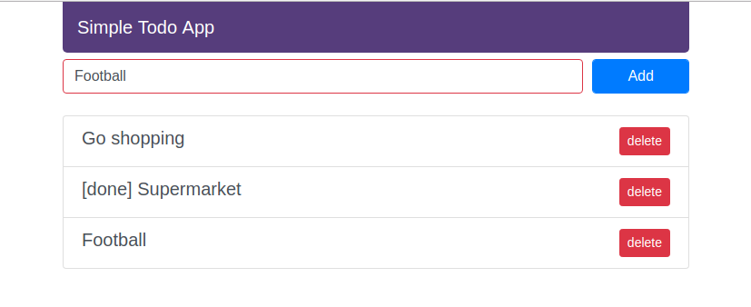

## ReactJS-Todo
Simple ReactJS Todo app

-----

-----

Clone/download repository to your local

    git clone https://github.com/o11/ReactJS-Todo.git
    
Change the directory to where you download the repository     

    cd ReactJS-Todo
    
Install the dependency

    npm install 
    
Start the server

    npm start
 

